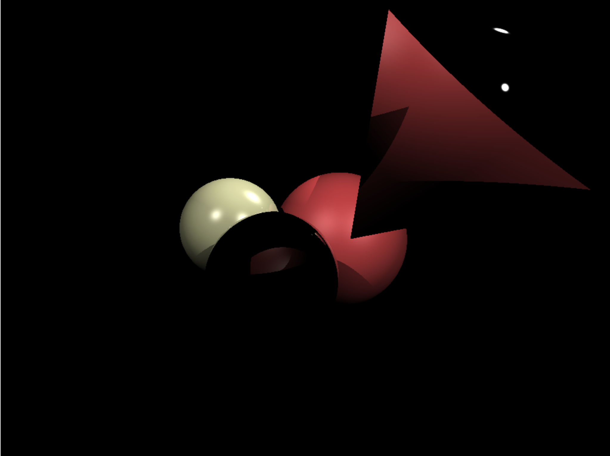

# RayJS - Tiny Raytracer

This Raytracer takes about 230 LoC and features:
- reflection
- optimised canvas drawing
- Sphere ray intersection
- Triangle ray intersection
- Phong shading

Open index.html and check the results. Rendering takes about 15 seconds and drawing is optimised to 0.2s.

## Example
```javascript
let ivory = new Material(new Vec3d(0.6,  0.3, 0.1), new Vec3d(0.4, 0.4, 0.3),   50.);
let red_rubber = new Material(new Vec3d(0.9,  0.1, 0), new Vec3d(0.3, 0.1, 0.1),   10.);
let mirror = new Material(new Vec3d(0.,10,0.8), new Vec3d(1,1,1),1425.);
let lights = [];
let objs = [];
lights.push(new Light(new Vec3d(-20, 20,  20), 1.5));
lights.push(new Light(new Vec3d( 30, 50, -25), 1.8));
lights.push(new Light(new Vec3d( 30, 20,  30), 1.7));
objs.push(new Sphere(new Vec3d( 1.5, -0.5, -18), 3, red_rubber));
objs.push(new Sphere(new Vec3d(-1.0, -1.5, -12), 2, mirror));
objs.push(new Sphere(new Vec3d(-3,    0,   -16), 2,      ivory));
objs.push(new Sphere(new Vec3d( 7,    5,   -18), 4,      mirror));
objs.push(new Triangle(new Vec3d( 1, -0.5, -12),new Vec3d( 3, 4.5, -12),new Vec3d( 6, -0.5, -12), red_rubber))
init();
render(objs,lights);
draw();
```



## Misc

In the developer console you can use:
```javascript
demo();
```
To move the Cam a bit arround, but its pretty useless because the actual calculations take up to 15 seconds.
